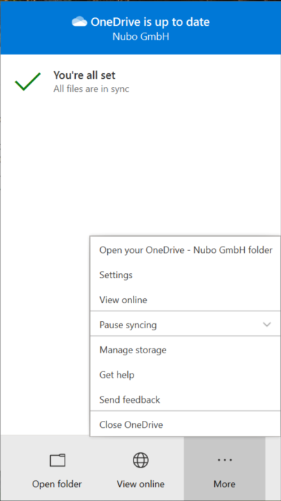

Microsoft introduced a 'Get Help' and 'Send Feedback' option for OneDrive for Business. This is a useful way for users to contact directly Microsoft inside the application. With this setting, users generate support tickets for OneDrive for Business by selecting either Get Help or Send feedback.

{:.center}

This is a welcome service provided by Microsoft reducing the ticket load for local IT. On the other hand, some organizations want to control the ticket flow using their own internal processes. For these situations, the options might be misleading for the own user base. Therefore, Microsoft allows to disable both settings using a tenant configuration.

You can change the default value using the SharePoint Online PowerShell commandlets with a user having at least SharePoint Online Administrator permissions.

