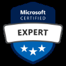

IT administrators that want to prove they have a proper evaluation, planning, migration, deployment, and management skills for Microsoft 365 should consider the [Microsoft 365 Certified Enterprise Administrator Expert](https://www.microsoft.com/en-us/learning/m365-enterprise-administrator.aspx) certification.

{:.center}

You have to pass the [MS-100](https://www.microsoft.com/en-us/learning/exam-ms-100.aspx) and [MS-101](https://www.microsoft.com/en-us/learning/exam-ms-101.aspx) exams and one of the Microsoft 365 workload administrator certifications listed below:
* Microsoft 365 Certified: Modern Desktop Administrator Associate ([MD-100](https://www.microsoft.com/en-us/learning/exam-md-100.aspx))
* Microsoft 365 Certified: Teamwork Administrator ([MS-300](https://www.microsoft.com/en-us/learning/exam-ms-300.aspx) and [MS-301](https://www.microsoft.com/en-us/learning/exam-ms-301.aspx))
* Microsoft 365 Certified: Security Administrator Associate ([MS-500](https://www.microsoft.com/en-us/learning/exam-ms-500.aspx))
* Microsoft 365 Certified: Messaging Administrator Associate ([MS-200](https://www.microsoft.com/en-us/learning/exam-ms-200.aspx) and [MS-201](https://www.microsoft.com/en-us/learning/exam-ms-201.aspx))

You see from the list above that Microsoft allows IT professionals with different backgrounds to achieve the **Microsoft 365 Certified Enterprise Administrator Expert**. If you take me as an example, the focus in the past years was based on teamwork and collaboration workloads in Microsoft. Therefore, the most convenient path for me to achieve the **Microsoft 365 Certified Enterprise Administrator Expert** is to complete the exams [MS-300](https://www.microsoft.com/en-us/learning/exam-ms-300.aspx), [MS-301](https://www.microsoft.com/en-us/learning/exam-ms-301.aspx), [MS-100](https://www.microsoft.com/en-us/learning/exam-ms-100.aspx), and [MS-101](https://www.microsoft.com/en-us/learning/exam-ms-101.aspx).

> Microsoft also provides an entry-level certification that tests your knowledge about the options available in Microsoft 365 and the benefits of adopting cloud services, the Software as a Service (SaaS) cloud model, and implementing Microsoft 365 cloud service ([MS-900](https://www.microsoft.com/en-us/learning/exam-ms-900.aspx)). 