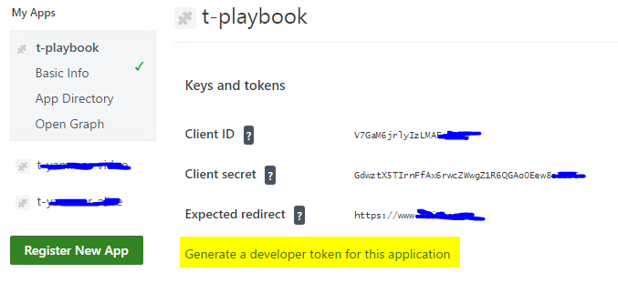

Yammer provides good APIs to access and interact with a Yammer network. You can get an overview of the access possibilities by opening the [Yammer developer center](https://developer.microsoft.com/en-us/yammer). The API we are going to use is the Yammer REST API. In this blog post I am going to describe the steps necessary to perform a REST API operation through PowerShell as an administrator. I am going to create more posts to describe other activities through REST in future posts. 

### Register an app
You first have to register an application on your network. We are going to use this app to execute the authentication process and perform the operations. You can create new apps as verified administrator by following these steps:
- Log in as a verified admin to your Yammer network
- Once logged in type in the address https://www.yammer.com/client_applications
- Register a new application. You can put a fake address to the *Expected redirect URL*
- Once registered *generate a developer token for this application*

The authentication can be done by following [server side flow authentication](https://developer.yammer.com/docs/oauth-2). I prefer to use the *generate a developer token for this application* to avoid these steps and directly jump to the development.

{:.center}

Generate the developer token as a verified admin and use this token as *bearer token* in the next code snippets. 

### Write the code
With a generated token it is no more difficult to perform operations with the Rest API. The next code snippet returns the Yammer message IDs using the API endpoint described [here](https://developer.yammer.com/docs/messagesjson). The next snipped is an example that we are going to use for future posts.

    Always consider the <a href="https://developer.yammer.com/docs/rest-api-rate-limits">REST API and Rate Limits</a> when accessing a Yammer network. 

