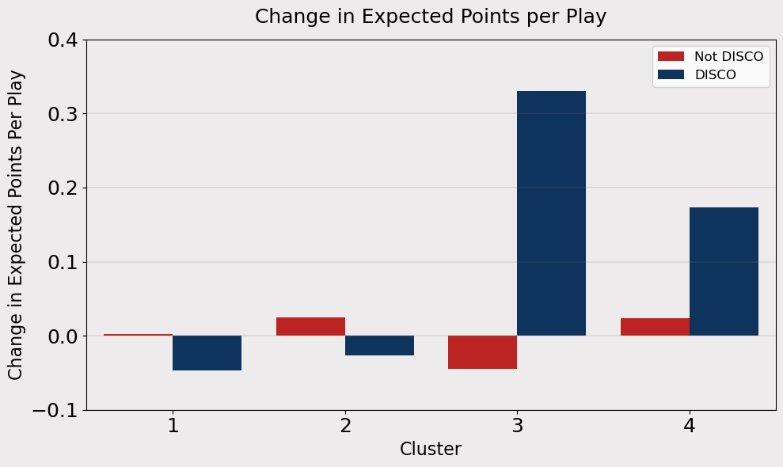

#### DISCO: A metric and analysis of **DIS**guised **CO**verages on Defense

 

## Introduction

Game theory and deception are components to almost every single play in football.  In addition to great talent, football fans love to watch how head coaches, coordinators, and players are constantly trying to outsmart their opponents.  One of many opportunities for teams to leverage deception is with defensive pre-snap alignments, when a defense’s goal is to confuse the offense as to what pass coverage they will run.  Perhaps they are disguising a coverage, or they want the offense to *believe* a disguised coverage is coming when it is not.  Thanks to the NFL and Next Gen Stats, we propose a metric that evaluates the frequency each team’s defense disguises their coverage in the moments before the ball is snapped: *DISCO*

#### ***DISCO***: ***DIS***guised ***CO***verage %:
- The percent of plays a team’s defense transforms to an unlikely pass coverage given their pre-snap alignment and movements

$$
\text{DISCO} = \frac{\text{Plays where defense transformed into an unlikely post-snap coverage}}{\text{Total plays}}
$$

- Unlikely is defined as a coverage that is observed (across NFL) less than 10% of plays given the pre-snap alignment

- Note: This metric can also be broken down by pre-snap alignment type

## Approach for Developing DISCO

Our approach involves leveraging an unsupervised machine learning model, [K-Medoids](https://medium.com/@prasanNH/exploring-the-world-of-clustering-k-means-vs-k-medoids-f648ea738508), to separate pre-snap alignments and movements into clusters, and then to analyze the resulting clusters to learn about what they entail post-snap.   Considering the behaviors of defensive backs pre-snap provide the best indications into what coverage the defense may run, we found that linemen and linebacker data added noise to our model that did not enhance our output and analysis.

We capture the location and orientation metrics at *two seconds before the snap*, and motion metrics throughout the pre-snap period.  We found that defenses are more likely to reveal their alignment as time passes from the huddle break, yet we need to use a time early enough that the metric can be relevant to a QB/offense who has a moment to process what is observed.

##### We considered the following metrics for the model (as if play direction is horizontal, left to right):

-	Deepest safety/DB horizontal distance from ball
-	Deepest safety/DB vertical distance/direction from ball
-	2nd deepest safety/DB horizontal distance from ball
-	2nd deepest safety/DB vertical distance/direction from ball
-   Two deepest backs vertical distance/direction from center of field
-   All DB direction of pre-snap motion
-   Two deepest safeties/DB's angle of body orientation
-	For each CB
    - Horizontal distance from ball
    - Vertical distance/direction from ball
    - Horizontal distance from nearest receiver
    - Vertical distance/direction from nearest receiver
    - Angle of body orientation
-	For offensive plays using a pre-snap motion
    - Defender motion relative to receiver motion

##### Potentially relevant metrics not included:
- Verbal signals
- Hand gestures/pointing
- Direction player is leaning
- Direction a player is looking (independent  of body orientation)
- Game situation (e.g. - down, yards, score, previous play(s)
- Team historical alignments

The objective of the K-Medoids model is to identify data points among a cluster of similar data (data within proximity) while differentiating data points that are far apart.  For example, just as a QB can often spot the difference between a Cover 1 and Cover 3 based on the distance defensive backs are from receivers, response to motion and perhaps their body orientation, even if both have a similar location of a middle deep safety, the cluster algorithm can recognize those alignments as distinct.  The purpose of identifying unique clusters in an unsupervised model is not to predict the defenses coverage, but to further explore post-snap coverages as a function of pre-snap alignments.  

## Cluster Results

Theoretically, pre-snap alignments can be grouped into any number of clusters.  Our model found that 4 was the fewest distinct groupings to signal meaningful and insightful differences, yet few enough to be practical and to not overfit clusters.  As we see in the below chart, defenses can and have operated in any coverage from any pre-snap alignment cluster, however, we do find unique patterns across clusters.

Note: We are just showing the most common pass coverages, and all types of coverage within the same category are grouped together.  E.g. – Cover 3 Cloud Left, Cover 3 Cloud Right

<table id="T_1d763">
  <caption>% of Post Snap Coverage Given Pre Snap Cluster</caption>
  <thead>
    <tr>
      <th id="T_1d763_level0_col0" class="col_heading level0 col0" ></th>
      <th id="T_1d763_level0_col1" class="col_heading level0 col1" >Cover 0</th>
      <th id="T_1d763_level0_col2" class="col_heading level0 col2" >Cover 1</th>
      <th id="T_1d763_level0_col3" class="col_heading level0 col3" >Cover 2</th>
      <th id="T_1d763_level0_col4" class="col_heading level0 col4" >Cover 3</th>
      <th id="T_1d763_level0_col5" class="col_heading level0 col5" >Quarters</th>
      <th id="T_1d763_level0_col6" class="col_heading level0 col6" >Cover 6</th>
    </tr>
  </thead>
  <tbody>
    <tr>
      <td id="T_1d763_row0_col0" class="data row0 col0" >Pre Snap Cluster-1</td>
      <td id="T_1d763_row0_col1" class="data row0 col1" >4%</td>
      <td id="T_1d763_row0_col2" class="data row0 col2" >14%</td>
      <td id="T_1d763_row0_col3" class="data row0 col3" >9%</td>
      <td id="T_1d763_row0_col4" class="data row0 col4" >50%</td>
      <td id="T_1d763_row0_col5" class="data row0 col5" >15%</td>
      <td id="T_1d763_row0_col6" class="data row0 col6" >7%</td>
    </tr>
    <tr>
      <td id="T_1d763_row1_col0" class="data row1 col0" >Pre Snap Cluster-2</td>
      <td id="T_1d763_row1_col1" class="data row1 col1" >7%</td>
      <td id="T_1d763_row1_col2" class="data row1 col2" >53%</td>
      <td id="T_1d763_row1_col3" class="data row1 col3" >8%</td>
      <td id="T_1d763_row1_col4" class="data row1 col4" >30%</td>
      <td id="T_1d763_row1_col5" class="data row1 col5" >2%</td>
      <td id="T_1d763_row1_col6" class="data row1 col6" >1%</td>
    </tr>
    <tr>
      <td id="T_1d763_row2_col0" class="data row2 col0" >Pre Snap Cluster-3</td>
      <td id="T_1d763_row2_col1" class="data row2 col1" >2%</td>
      <td id="T_1d763_row2_col2" class="data row2 col2" >19%</td>
      <td id="T_1d763_row2_col3" class="data row2 col3" >19%</td>
      <td id="T_1d763_row2_col4" class="data row2 col4" >28%</td>
      <td id="T_1d763_row2_col5" class="data row2 col5" >17%</td>
      <td id="T_1d763_row2_col6" class="data row2 col6" >15%</td>
    </tr>
    <tr>
      <td id="T_1d763_row3_col0" class="data row3 col0" >Pre Snap Cluster-4</td>
      <td id="T_1d763_row3_col1" class="data row3 col1" >1%</td>
      <td id="T_1d763_row3_col2" class="data row3 col2" >20%</td>
      <td id="T_1d763_row3_col3" class="data row3 col3" >23%</td>
      <td id="T_1d763_row3_col4" class="data row3 col4" >26%</td>
      <td id="T_1d763_row3_col5" class="data row3 col5" >15%</td>
      <td id="T_1d763_row3_col6" class="data row3 col6" >16%</td>
    </tr>
  </tbody>
</table>

 

Now that we have a sense of the frequency defenses operate different pass coverages from each cluster, we can explore how several of our model input metrics average out by Cluster.

Note:
- Metrics are adjusted as if all play directions are left to right
- 0 degrees is facing directly at the line of scrimmage to the left.

There are several takeaways but a few to note are:

- Clusters 1 and 2 tend to have the deepest DB aligned close to the center of the field
- Clusters 3 and 4 on average see the two deepest DB's aligned 5-6 yards off the center on each side   
- Cluster 2’s greatest distinction is having the combination of DB’s closest to the WR’s while the deepest DB is aligned in the center
- Clusters 3 and 4 have average separation between DB’s and WR’s greater than 5 yards
- A key distinction between Clusters 3 and 4 is the opposite Y-direction from the ball between the two deepest backs
- The average orientation of DB’s is lowest for Cluster 1

<table id="T_85e97">
  <caption>Average Value for Each Pre Snap Cluster</caption>
  <thead>
    <tr>
      <th id="T_85e97_level0_col0" class="col_heading level0 col0" >Metric</th>
      <th id="T_85e97_level0_col1" class="col_heading level0 col1" >Cluster 1</th>
      <th id="T_85e97_level0_col2" class="col_heading level0 col2" >Cluster 2</th>
      <th id="T_85e97_level0_col3" class="col_heading level0 col3" >Cluster 3</th>
      <th id="T_85e97_level0_col4" class="col_heading level0 col4" >Cluster 4</th>
    </tr>
  </thead>
  <tbody>
    <tr>
      <td id="T_85e97_row0_col0" class="data row0 col0" >Farthest DB X Yards  From Football</td>
      <td id="T_85e97_row0_col1" class="data row0 col1" >12.52</td>
      <td id="T_85e97_row0_col2" class="data row0 col2" >12.97</td>
      <td id="T_85e97_row0_col3" class="data row0 col3" >13.53</td>
      <td id="T_85e97_row0_col4" class="data row0 col4" >13.82</td>
    </tr>
    <tr>
      <td id="T_85e97_row1_col0" class="data row1 col0" >Farthest DB Y Yards From Football</td>
      <td id="T_85e97_row1_col1" class="data row1 col1" >0.59</td>
      <td id="T_85e97_row1_col2" class="data row1 col2" >0.29</td>
      <td id="T_85e97_row1_col3" class="data row1 col3" >-6.78</td>
      <td id="T_85e97_row1_col4" class="data row1 col4" >5.98</td>
    </tr>
    <tr>
      <td id="T_85e97_row2_col0" class="data row2 col0" >2nd Farthest DB X Yards From Football</td>
      <td id="T_85e97_row2_col1" class="data row2 col1" >8.42</td>
      <td id="T_85e97_row2_col2" class="data row2 col2" >5.75</td>
      <td id="T_85e97_row2_col3" class="data row2 col3" >11.05</td>
      <td id="T_85e97_row2_col4" class="data row2 col4" >11.02</td>
    </tr>
    <tr>
      <td id="T_85e97_row3_col0" class="data row3 col0" >2nd Fathest DB Y Yards From Ball</td>
      <td id="T_85e97_row3_col1" class="data row3 col1" >1.08</td>
      <td id="T_85e97_row3_col2" class="data row3 col2" >-4.86</td>
      <td id="T_85e97_row3_col3" class="data row3 col3" >5.93</td>
      <td id="T_85e97_row3_col4" class="data row3 col4" >-6.20</td>
    </tr>
    <tr>
      <td id="T_85e97_row4_col0" class="data row4 col0" >Nearest DB X Yards From WR1</td>
      <td id="T_85e97_row4_col1" class="data row4 col1" >5.83</td>
      <td id="T_85e97_row4_col2" class="data row4 col2" >2.35</td>
      <td id="T_85e97_row4_col3" class="data row4 col3" >3.26</td>
      <td id="T_85e97_row4_col4" class="data row4 col4" >2.84</td>
    </tr>
    <tr>
      <td id="T_85e97_row5_col0" class="data row5 col0" >Nearest DB Y Yards From WR1</td>
      <td id="T_85e97_row5_col1" class="data row5 col1" >6.10</td>
      <td id="T_85e97_row5_col2" class="data row5 col2" >4.73</td>
      <td id="T_85e97_row5_col3" class="data row5 col3" >6.08</td>
      <td id="T_85e97_row5_col4" class="data row5 col4" >5.54</td>
    </tr>
    <tr>
      <td id="T_85e97_row6_col0" class="data row6 col0" >Nearest DB X Yards From WR2</td>
      <td id="T_85e97_row6_col1" class="data row6 col1" >3.49</td>
      <td id="T_85e97_row6_col2" class="data row6 col2" >3.34</td>
      <td id="T_85e97_row6_col3" class="data row6 col3" >5.52</td>
      <td id="T_85e97_row6_col4" class="data row6 col4" >5.00</td>
    </tr>
    <tr>
      <td id="T_85e97_row7_col0" class="data row7 col0" >Nearest DB Y Yards From WR2</td>
      <td id="T_85e97_row7_col1" class="data row7 col1" >2.35</td>
      <td id="T_85e97_row7_col2" class="data row7 col2" >3.54</td>
      <td id="T_85e97_row7_col3" class="data row7 col3" >4.94</td>
      <td id="T_85e97_row7_col4" class="data row7 col4" >5.31</td>
    </tr>
    <tr>
      <td id="T_85e97_row8_col0" class="data row8 col0" >Nearest DB to WR1 Orientation Degrees From LOS</td>
      <td id="T_85e97_row8_col1" class="data row8 col1" >8.63</td>
      <td id="T_85e97_row8_col2" class="data row8 col2" >29.29</td>
      <td id="T_85e97_row8_col3" class="data row8 col3" >20.41</td>
      <td id="T_85e97_row8_col4" class="data row8 col4" >26.57</td>
    </tr>
    <tr>
      <td id="T_85e97_row9_col0" class="data row9 col0" >2nd Nearest DB to WR2 Orientation Degrees From LOS</td>
      <td id="T_85e97_row9_col1" class="data row9 col1" >0.83</td>
      <td id="T_85e97_row9_col2" class="data row9 col2" >15.14</td>
      <td id="T_85e97_row9_col3" class="data row9 col3" >9.20</td>
      <td id="T_85e97_row9_col4" class="data row9 col4" >8.65</td>
    </tr>
  </tbody>
</table>

 

## Visualizing the Clusters in Action

With a basic understanding of the differentiators of each cluster, we can now look at a sample play from each, plus one additional example of a disguised coverage from a (lack of) motion.

## Cluster 1: Jazz

Like jazz music, this pre-snap alignment allows for a smooth transition into its most common coverage, Cover 3.   There is one deep safety, but other DBs are not pressing receivers.  In this play, Kyler Murray looks to hit Marquise Brown over the middle just across the first down marker. After Brown bounces off the would-be tackler, he gives the Cardinals more than they bargained for with a touchdown.

Press the play button to watch (time speed is 2x), or watch the play manually by adjusting the time toggle.  

<iframe
    scrolling="no"
    width="595px"
    height="520"
    src="../assets/images/2025-01-07-Sunday_Afternoon_Fever/iframe_figures/figure_1.html"
    frameborder="0"
    allowfullscreen
></iframe>

## Cluster 2: Rock n’ Roll
Just as a rock song can stand out with a great guitar solo, the solo DB stands out in the Cluster 2 alignment.  Here, in addition to one deep safety, a pre-snap motion is shadowed by the Saints DB. Tom Brady likes the outside 1-on-1 matchup with his wide receiver, Breshad Perriman, who catches the 4th quarter go-ahead touchdown.

<iframe
    scrolling="no"
    width="595px"
    height="520"
    src="../assets/images/2025-01-07-Sunday_Afternoon_Fever/iframe_figures/figure_2.html"
    frameborder="0"
    allowfullscreen
></iframe>

## Cluster 3: Classical
This alignment is structured in a methodical way, much like classical music.  Compared to Clusters 1 and 2, several coverages are within the norm from this alignment.  In this play, the Bears drop into a Cover 2, but there are elements to the alignment that closely resemble other coverages. We can observe two DBs pressed closely to wide receivers and the highest DB near the center of the field until drifting wide in the final two seconds before the snap (our timestamp for measuring an alignment cluster).  Ultimately, DB #22 Kindle Vindor drops to coverage and comes up with the interception.  

<iframe
    scrolling="no"
    width="595px"
    height="520"
    src="../assets/images/2025-01-07-Sunday_Afternoon_Fever/iframe_figures/figure_3.html"
    frameborder="0"
    allowfullscreen
></iframe>

## Cluster 4:  Electronic
While electronic music is versatile with a variety of tones, beats, and rhythms, this alignment follows suit by being the most versatile to coverage variety.  Cover 2, Quarters, and Cover 6 are not represented as the most common coverage for any cluster, but this cluster would be closest for all three.  In the below case, the Bengals show two deep backs on each side of the field, are not pressing any receivers until the final second, and drop into Quarters. Tua Tagovailoa hits Tyreek Hill on the center deep ball, nicely finding the gap in coverage.

<iframe
    scrolling="no"
    width="595px"
    height="520"
    src="../assets/images/2025-01-07-Sunday_Afternoon_Fever/iframe_figures/figure_4.html"
    frameborder="0"
    allowfullscreen
></iframe>

## DISCO with a Pre-Snap Motion

While the previous examples showed a non-DISCO play for each cluster, the following example demonstrates how the Broncos disguised a Cover 1 from Cluster 4.  In this case, the Jets motion a receiver across the field.  There is some subtle movement from the DBs but considering no defensive player directly followed the receiver in motion and we observe two deep backs on each side of the field (similarly to the previous example), Cluster 4 is the classified alignment.  Within a second of the snap, the Broncos' alignment starts to shift towards Cluster 1.  When the play is in action, we see one safety drop back deep middle, and the other defenders immediately find their man assignment.

<iframe
    scrolling="no"
    width="595px"
    height="520"
    src="../assets/images/2025-01-07-Sunday_Afternoon_Fever/iframe_figures/figure_5.html"
    frameborder="0"
    allowfullscreen
></iframe>

## DISCO Results

After identifying plays that qualify as DISCO, we can analyze the frequency of plays a team’s defense disguises coverage (weeks 1-9 in NFL 2022-23 season), as well as a breakdown of DISCO frequencies relative to each cluster for that team.   While the Vikings used DISCO more frequently than any other team, the Jaguars used a Cluster 2 disguise at the highest rate.  With further analysis, it may also be determined that some teams are known to prefer more often aligning untraditionally for a given coverage depending on their personnel and other factors.

Note: Plays under two minutes in a half, at the goal-line, or during 3-score games in the second half are excluded from eligibility, as we found DISCO plays are extremely uncommon in those situations.

<table id="T_4b3b5">
  <caption>Frequency of DISCO Plays by Team</caption>
  <thead>
    <tr>
      <th id="T_4b3b5_level0_col0" class="col_heading level0 col0" >Team</th>
      <th id="T_4b3b5_level0_col1" class="col_heading level0 col1" >DISCO</th>
      <th id="T_4b3b5_level0_col2" class="col_heading level0 col2" >DISCO Cluster 1</th>
      <th id="T_4b3b5_level0_col3" class="col_heading level0 col3" >DISCO Cluster 2</th>
      <th id="T_4b3b5_level0_col4" class="col_heading level0 col4" >DISCO Cluster 3</th>
      <th id="T_4b3b5_level0_col5" class="col_heading level0 col5" >DISCO Cluster 4</th>
    </tr>
  </thead>
  <tbody>
    <tr>
      <td id="T_4b3b5_row0_col0" class="data row0 col0" ></td>
      <td id="T_4b3b5_row0_col1" class="data row0 col1" >25%</td>
      <td id="T_4b3b5_row0_col2" class="data row0 col2" >40%</td>
      <td id="T_4b3b5_row0_col3" class="data row0 col3" >22%</td>
      <td id="T_4b3b5_row0_col4" class="data row0 col4" >4%</td>
      <td id="T_4b3b5_row0_col5" class="data row0 col5" >2%</td>
    </tr>
    <tr>
      <td id="T_4b3b5_row1_col0" class="data row1 col0" ></td>
      <td id="T_4b3b5_row1_col1" class="data row1 col1" >24%</td>
      <td id="T_4b3b5_row1_col2" class="data row1 col2" >34%</td>
      <td id="T_4b3b5_row1_col3" class="data row1 col3" >22%</td>
      <td id="T_4b3b5_row1_col4" class="data row1 col4" >6%</td>
      <td id="T_4b3b5_row1_col5" class="data row1 col5" >2%</td>
    </tr>
    <tr>
      <td id="T_4b3b5_row2_col0" class="data row2 col0" ></td>
      <td id="T_4b3b5_row2_col1" class="data row2 col1" >23%</td>
      <td id="T_4b3b5_row2_col2" class="data row2 col2" >32%</td>
      <td id="T_4b3b5_row2_col3" class="data row2 col3" >21%</td>
      <td id="T_4b3b5_row2_col4" class="data row2 col4" >13%</td>
      <td id="T_4b3b5_row2_col5" class="data row2 col5" >4%</td>
    </tr>
    <tr>
      <td id="T_4b3b5_row3_col0" class="data row3 col0" ></td>
      <td id="T_4b3b5_row3_col1" class="data row3 col1" >22%</td>
      <td id="T_4b3b5_row3_col2" class="data row3 col2" >32%</td>
      <td id="T_4b3b5_row3_col3" class="data row3 col3" >17%</td>
      <td id="T_4b3b5_row3_col4" class="data row3 col4" >9%</td>
      <td id="T_4b3b5_row3_col5" class="data row3 col5" >0%</td>
    </tr>
    <tr>
      <td id="T_4b3b5_row4_col0" class="data row4 col0" ></td>
      <td id="T_4b3b5_row4_col1" class="data row4 col1" >21%</td>
      <td id="T_4b3b5_row4_col2" class="data row4 col2" >27%</td>
      <td id="T_4b3b5_row4_col3" class="data row4 col3" >18%</td>
      <td id="T_4b3b5_row4_col4" class="data row4 col4" >7%</td>
      <td id="T_4b3b5_row4_col5" class="data row4 col5" >9%</td>
    </tr>
    <tr>
      <td id="T_4b3b5_row5_col0" class="data row5 col0" ></td>
      <td id="T_4b3b5_row5_col1" class="data row5 col1" >21%</td>
      <td id="T_4b3b5_row5_col2" class="data row5 col2" >25%</td>
      <td id="T_4b3b5_row5_col3" class="data row5 col3" >23%</td>
      <td id="T_4b3b5_row5_col4" class="data row5 col4" >7%</td>
      <td id="T_4b3b5_row5_col5" class="data row5 col5" >4%</td>
    </tr>
    <tr>
      <td id="T_4b3b5_row6_col0" class="data row6 col0" ></td>
      <td id="T_4b3b5_row6_col1" class="data row6 col1" >21%</td>
      <td id="T_4b3b5_row6_col2" class="data row6 col2" >31%</td>
      <td id="T_4b3b5_row6_col3" class="data row6 col3" >17%</td>
      <td id="T_4b3b5_row6_col4" class="data row6 col4" >9%</td>
      <td id="T_4b3b5_row6_col5" class="data row6 col5" >7%</td>
    </tr>
    <tr>
      <td id="T_4b3b5_row7_col0" class="data row7 col0" ></td>
      <td id="T_4b3b5_row7_col1" class="data row7 col1" >19%</td>
      <td id="T_4b3b5_row7_col2" class="data row7 col2" >21%</td>
      <td id="T_4b3b5_row7_col3" class="data row7 col3" >15%</td>
      <td id="T_4b3b5_row7_col4" class="data row7 col4" >21%</td>
      <td id="T_4b3b5_row7_col5" class="data row7 col5" >12%</td>
    </tr>
    <tr>
      <td id="T_4b3b5_row8_col0" class="data row8 col0" ></td>
      <td id="T_4b3b5_row8_col1" class="data row8 col1" >19%</td>
      <td id="T_4b3b5_row8_col2" class="data row8 col2" >24%</td>
      <td id="T_4b3b5_row8_col3" class="data row8 col3" >13%</td>
      <td id="T_4b3b5_row8_col4" class="data row8 col4" >6%</td>
      <td id="T_4b3b5_row8_col5" class="data row8 col5" >3%</td>
    </tr>
    <tr>
      <td id="T_4b3b5_row9_col0" class="data row9 col0" ></td>
      <td id="T_4b3b5_row9_col1" class="data row9 col1" >18%</td>
      <td id="T_4b3b5_row9_col2" class="data row9 col2" >26%</td>
      <td id="T_4b3b5_row9_col3" class="data row9 col3" >33%</td>
      <td id="T_4b3b5_row9_col4" class="data row9 col4" >0%</td>
      <td id="T_4b3b5_row9_col5" class="data row9 col5" >2%</td>
    </tr>
    <tr>
      <td id="T_4b3b5_row10_col0" class="data row10 col0" ></td>
      <td id="T_4b3b5_row10_col1" class="data row10 col1" >18%</td>
      <td id="T_4b3b5_row10_col2" class="data row10 col2" >23%</td>
      <td id="T_4b3b5_row10_col3" class="data row10 col3" >26%</td>
      <td id="T_4b3b5_row10_col4" class="data row10 col4" >0%</td>
      <td id="T_4b3b5_row10_col5" class="data row10 col5" >2%</td>
    </tr>
    <tr>
      <td id="T_4b3b5_row11_col0" class="data row11 col0" ></td>
      <td id="T_4b3b5_row11_col1" class="data row11 col1" >18%</td>
      <td id="T_4b3b5_row11_col2" class="data row11 col2" >31%</td>
      <td id="T_4b3b5_row11_col3" class="data row11 col3" >29%</td>
      <td id="T_4b3b5_row11_col4" class="data row11 col4" >7%</td>
      <td id="T_4b3b5_row11_col5" class="data row11 col5" >10%</td>
    </tr>
    <tr>
      <td id="T_4b3b5_row12_col0" class="data row12 col0" ></td>
      <td id="T_4b3b5_row12_col1" class="data row12 col1" >17%</td>
      <td id="T_4b3b5_row12_col2" class="data row12 col2" >26%</td>
      <td id="T_4b3b5_row12_col3" class="data row12 col3" >11%</td>
      <td id="T_4b3b5_row12_col4" class="data row12 col4" >4%</td>
      <td id="T_4b3b5_row12_col5" class="data row12 col5" >2%</td>
    </tr>
    <tr>
      <td id="T_4b3b5_row13_col0" class="data row13 col0" ></td>
      <td id="T_4b3b5_row13_col1" class="data row13 col1" >17%</td>
      <td id="T_4b3b5_row13_col2" class="data row13 col2" >25%</td>
      <td id="T_4b3b5_row13_col3" class="data row13 col3" >24%</td>
      <td id="T_4b3b5_row13_col4" class="data row13 col4" >6%</td>
      <td id="T_4b3b5_row13_col5" class="data row13 col5" >2%</td>
    </tr>
    <tr>
      <td id="T_4b3b5_row14_col0" class="data row14 col0" ></td>
      <td id="T_4b3b5_row14_col1" class="data row14 col1" >16%</td>
      <td id="T_4b3b5_row14_col2" class="data row14 col2" >27%</td>
      <td id="T_4b3b5_row14_col3" class="data row14 col3" >18%</td>
      <td id="T_4b3b5_row14_col4" class="data row14 col4" >2%</td>
      <td id="T_4b3b5_row14_col5" class="data row14 col5" >5%</td>
    </tr>
    <tr>
      <td id="T_4b3b5_row15_col0" class="data row15 col0" ></td>
      <td id="T_4b3b5_row15_col1" class="data row15 col1" >15%</td>
      <td id="T_4b3b5_row15_col2" class="data row15 col2" >19%</td>
      <td id="T_4b3b5_row15_col3" class="data row15 col3" >20%</td>
      <td id="T_4b3b5_row15_col4" class="data row15 col4" >4%</td>
      <td id="T_4b3b5_row15_col5" class="data row15 col5" >3%</td>
    </tr>
    <tr>
      <td id="T_4b3b5_row16_col0" class="data row16 col0" ></td>
      <td id="T_4b3b5_row16_col1" class="data row16 col1" >15%</td>
      <td id="T_4b3b5_row16_col2" class="data row16 col2" >20%</td>
      <td id="T_4b3b5_row16_col3" class="data row16 col3" >12%</td>
      <td id="T_4b3b5_row16_col4" class="data row16 col4" >11%</td>
      <td id="T_4b3b5_row16_col5" class="data row16 col5" >4%</td>
    </tr>
    <tr>
      <td id="T_4b3b5_row17_col0" class="data row17 col0" ></td>
      <td id="T_4b3b5_row17_col1" class="data row17 col1" >14%</td>
      <td id="T_4b3b5_row17_col2" class="data row17 col2" >14%</td>
      <td id="T_4b3b5_row17_col3" class="data row17 col3" >19%</td>
      <td id="T_4b3b5_row17_col4" class="data row17 col4" >9%</td>
      <td id="T_4b3b5_row17_col5" class="data row17 col5" >0%</td>
    </tr>
    <tr>
      <td id="T_4b3b5_row18_col0" class="data row18 col0" ></td>
      <td id="T_4b3b5_row18_col1" class="data row18 col1" >14%</td>
      <td id="T_4b3b5_row18_col2" class="data row18 col2" >13%</td>
      <td id="T_4b3b5_row18_col3" class="data row18 col3" >32%</td>
      <td id="T_4b3b5_row18_col4" class="data row18 col4" >4%</td>
      <td id="T_4b3b5_row18_col5" class="data row18 col5" >1%</td>
    </tr>
    <tr>
      <td id="T_4b3b5_row19_col0" class="data row19 col0" ></td>
      <td id="T_4b3b5_row19_col1" class="data row19 col1" >13%</td>
      <td id="T_4b3b5_row19_col2" class="data row19 col2" >15%</td>
      <td id="T_4b3b5_row19_col3" class="data row19 col3" >23%</td>
      <td id="T_4b3b5_row19_col4" class="data row19 col4" >4%</td>
      <td id="T_4b3b5_row19_col5" class="data row19 col5" >5%</td>
    </tr>
    <tr>
      <td id="T_4b3b5_row20_col0" class="data row20 col0" ></td>
      <td id="T_4b3b5_row20_col1" class="data row20 col1" >13%</td>
      <td id="T_4b3b5_row20_col2" class="data row20 col2" >17%</td>
      <td id="T_4b3b5_row20_col3" class="data row20 col3" >12%</td>
      <td id="T_4b3b5_row20_col4" class="data row20 col4" >0%</td>
      <td id="T_4b3b5_row20_col5" class="data row20 col5" >3%</td>
    </tr>
    <tr>
      <td id="T_4b3b5_row21_col0" class="data row21 col0" ></td>
      <td id="T_4b3b5_row21_col1" class="data row21 col1" >13%</td>
      <td id="T_4b3b5_row21_col2" class="data row21 col2" >19%</td>
      <td id="T_4b3b5_row21_col3" class="data row21 col3" >13%</td>
      <td id="T_4b3b5_row21_col4" class="data row21 col4" >0%</td>
      <td id="T_4b3b5_row21_col5" class="data row21 col5" >5%</td>
    </tr>
    <tr>
      <td id="T_4b3b5_row22_col0" class="data row22 col0" ></td>
      <td id="T_4b3b5_row22_col1" class="data row22 col1" >12%</td>
      <td id="T_4b3b5_row22_col2" class="data row22 col2" >15%</td>
      <td id="T_4b3b5_row22_col3" class="data row22 col3" >23%</td>
      <td id="T_4b3b5_row22_col4" class="data row22 col4" >0%</td>
      <td id="T_4b3b5_row22_col5" class="data row22 col5" >0%</td>
    </tr>
    <tr>
      <td id="T_4b3b5_row23_col0" class="data row23 col0" ></td>
      <td id="T_4b3b5_row23_col1" class="data row23 col1" >12%</td>
      <td id="T_4b3b5_row23_col2" class="data row23 col2" >15%</td>
      <td id="T_4b3b5_row23_col3" class="data row23 col3" >27%</td>
      <td id="T_4b3b5_row23_col4" class="data row23 col4" >0%</td>
      <td id="T_4b3b5_row23_col5" class="data row23 col5" >5%</td>
    </tr>
    <tr>
      <td id="T_4b3b5_row24_col0" class="data row24 col0" ></td>
      <td id="T_4b3b5_row24_col1" class="data row24 col1" >12%</td>
      <td id="T_4b3b5_row24_col2" class="data row24 col2" >16%</td>
      <td id="T_4b3b5_row24_col3" class="data row24 col3" >12%</td>
      <td id="T_4b3b5_row24_col4" class="data row24 col4" >3%</td>
      <td id="T_4b3b5_row24_col5" class="data row24 col5" >0%</td>
    </tr>
    <tr>
      <td id="T_4b3b5_row25_col0" class="data row25 col0" ></td>
      <td id="T_4b3b5_row25_col1" class="data row25 col1" >12%</td>
      <td id="T_4b3b5_row25_col2" class="data row25 col2" >15%</td>
      <td id="T_4b3b5_row25_col3" class="data row25 col3" >14%</td>
      <td id="T_4b3b5_row25_col4" class="data row25 col4" >4%</td>
      <td id="T_4b3b5_row25_col5" class="data row25 col5" >5%</td>
    </tr>
    <tr>
      <td id="T_4b3b5_row26_col0" class="data row26 col0" ></td>
      <td id="T_4b3b5_row26_col1" class="data row26 col1" >11%</td>
      <td id="T_4b3b5_row26_col2" class="data row26 col2" >24%</td>
      <td id="T_4b3b5_row26_col3" class="data row26 col3" >3%</td>
      <td id="T_4b3b5_row26_col4" class="data row26 col4" >1%</td>
      <td id="T_4b3b5_row26_col5" class="data row26 col5" >5%</td>
    </tr>
    <tr>
      <td id="T_4b3b5_row27_col0" class="data row27 col0" ></td>
      <td id="T_4b3b5_row27_col1" class="data row27 col1" >11%</td>
      <td id="T_4b3b5_row27_col2" class="data row27 col2" >13%</td>
      <td id="T_4b3b5_row27_col3" class="data row27 col3" >18%</td>
      <td id="T_4b3b5_row27_col4" class="data row27 col4" >2%</td>
      <td id="T_4b3b5_row27_col5" class="data row27 col5" >0%</td>
    </tr>
    <tr>
      <td id="T_4b3b5_row28_col0" class="data row28 col0" ></td>
      <td id="T_4b3b5_row28_col1" class="data row28 col1" >11%</td>
      <td id="T_4b3b5_row28_col2" class="data row28 col2" >15%</td>
      <td id="T_4b3b5_row28_col3" class="data row28 col3" >17%</td>
      <td id="T_4b3b5_row28_col4" class="data row28 col4" >1%</td>
      <td id="T_4b3b5_row28_col5" class="data row28 col5" >5%</td>
    </tr>
    <tr>
      <td id="T_4b3b5_row29_col0" class="data row29 col0" ></td>
      <td id="T_4b3b5_row29_col1" class="data row29 col1" >10%</td>
      <td id="T_4b3b5_row29_col2" class="data row29 col2" >16%</td>
      <td id="T_4b3b5_row29_col3" class="data row29 col3" >29%</td>
      <td id="T_4b3b5_row29_col4" class="data row29 col4" >4%</td>
      <td id="T_4b3b5_row29_col5" class="data row29 col5" >0%</td>
    </tr>
    <tr>
      <td id="T_4b3b5_row30_col0" class="data row30 col0" ></td>
      <td id="T_4b3b5_row30_col1" class="data row30 col1" >10%</td>
      <td id="T_4b3b5_row30_col2" class="data row30 col2" >15%</td>
      <td id="T_4b3b5_row30_col3" class="data row30 col3" >15%</td>
      <td id="T_4b3b5_row30_col4" class="data row30 col4" >1%</td>
      <td id="T_4b3b5_row30_col5" class="data row30 col5" >7%</td>
    </tr>
    <tr>
      <td id="T_4b3b5_row31_col0" class="data row31 col0" ></td>
      <td id="T_4b3b5_row31_col1" class="data row31 col1" >6%</td>
      <td id="T_4b3b5_row31_col2" class="data row31 col2" >5%</td>
      <td id="T_4b3b5_row31_col3" class="data row31 col3" >11%</td>
      <td id="T_4b3b5_row31_col4" class="data row31 col4" >4%</td>
      <td id="T_4b3b5_row31_col5" class="data row31 col5" >2%</td>
    </tr>
  </tbody>
</table>

 

Lastly, in order to get a sense of how DISCO affects the game, we can plot the average change in expected points on each play, for each cluster.  We are making the assumption that a successful defensive play has a negative change in expected points (although there are situational cases where that might not be the case).

We find that for Cluster 1 and 2, DISCO plays have a notable negative edge vs non-DISCO plays.  For Clusters 3 and 4, there are less than 100 samples for each, nonetheless, those defensive plays underperformed non-DISCO, perhaps because many of those plays are Cover 0.

Overall, DISCO plays have a change in expected points per play of 0.02 less than non-DISCO plays.  

The 3 teams with the best difference in DISCO vs non-DISCO change in expected points per play were:
- Commanders: -0.53
- Jaguars: -0.50
- Saints: -0.44

    

    
 

## Conclusion, Limitations, and Future Enhancements

The DISCO metric is not an evaluation of defensive strategy, rather an analysis of defensive strategy.  Being unpredictable sometimes means playing the hand right in front of your opponent’s eyes. Factors such as game situation or player personnel could trump the desire to disguise in certain situations.  One intention for use of DISCO would be as a supplement to scouting, film, and pre-snap offensive decision making.   Another is for common NFL fans to leverage as they watch games, as it can be fun to predict what teams will do on each play.  

For future enhancements to DISCO:
- Incorporating the *potentially relevant metrics not included*, noted above
- Factoring in recent play history, game situation, and team's history would add more context into team's alignment decisions
- Leveraging a supervised machine learning algorithm that incorporates predictive behaviors
- Using more than 4 clusters may be relevant for some teams and lead to more precise results
- Incorporating less common pass coverages or more specific coverages
- Looking into blitz disguises (and fake blitzes)

## Acknowledgments

Thank you to the NFL analytics community and the hosts of the Big Data Bowl competition for engaging with fans and data enthusiasts in such a cool way!  Also, thank you to the data engineers and architects who developed Next Gen Stats and other NFL data, providing easily accessible and usable data to the public.  

## Appendix
All code is available in this [github repo](https://github.com/drewmalter12/nfl_big_data_bowl25).
