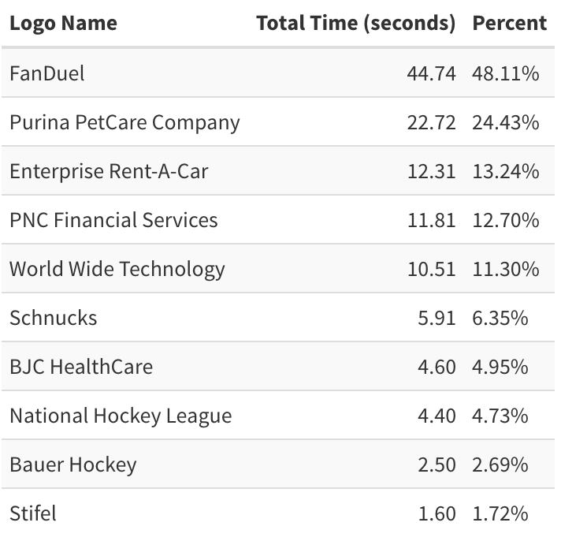

#### Tracking Logo Exposure Time in Sports Events for Negotiations and Marketing Deals

 

In the world of sports, sponsorship and advertising are integral to a team or league's revenue. Companies invest millions of dollars to place their logos in key spots—for example along the boards of the ice during an NHL game or rotating sideboards of MLB, NBA and Premier League soccer games. But what is the actual return on that investment? It’s well known that depending on the sport earlier or later in the game might have more viewership, but we can get even more specific in quantify a sponsor's exposure and value by tracking the time their logo is shown during the duration of an event. By combining viewership data, we can use a new metric in sports advertising, which we’ll call Total Viewership per Second of Exposure.

 

That’s exactly what we’ve done here using Google AI logo detection. For the purposes of this demonstration, we’ve stuck with the generic model that Google has built, but this or similar models can be retrained to learn better about identifying certain logos. 

 

 

Using Python, we used a video clip from the first period of a game between the Chicago Blackhawks and St. Louis Blues. Hockey is a quick moving sport with lots of moving players, so it’s unlikely that a logo will be 100% visible for more than a few seconds at a time. To solve for this problem, we’ve written an algorithm that uses the Google model to first identify if a logo in frame. We continue to track that logo over the next two frames as it’s possible a player quickly crossed the path between the camera and logo. If the same logo is detected two frames later, we count that as one continuous logo detection. We ran a highlight video from the first quarter of this game and below is the total amount of seconds that each logo was shown over a 93 second video. 

 

 

We all know that ad placement matters, but it was interesting to find how much difference in airtime two advertisements can have that are next to each. Over the course of a whole game, this can lead to several extra minutes of exposure. Tracking the time a logo is displayed during sports events provides both teams and sponsors with quantifiable metrics to measure the effectiveness of their deals. By leveraging this data, teams can offer more accurate sponsorship valuations, and companies can make more informed decisions about where and how to invest their marketing dollars. Knowing the duration of logo exposure gives both parties a powerful tool for negotiation and strategy.